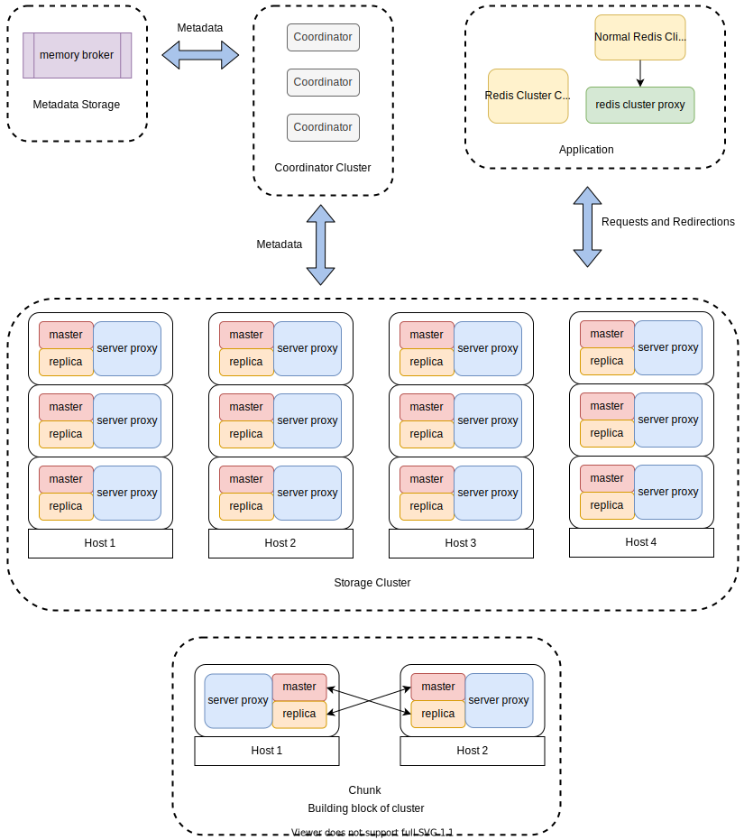

# Undermoon [](https://travis-ci.com/doyoubi/undermoon)
`Undermoon` is a self-managed Redis clustering system based on **Redis Cluster Protocol** supporting:

- Horizontal scalability and high availability
- Cluster management through HTTP API
- Automatic failover for both master and replica
- Fast scaling
- Both cluster-mode clients and non-cluster-mode clients.
- String value compression

Any storage system implementing redis protocol could also somehow work with undermoon,
such as [KeyDB](https://github.com/JohnSully/KeyDB).

For more in-depth explanation of Redis Cluster Protocol and how Undermoon implement it,
please refer to [Redis Cluster Protocol](./docs/redis_cluster_protocol.md).

## Architecture

##### Metadata Storage
Metadata storage stores all the metadata of the whole `undermoon` cluster,
including existing Redis instances, proxies, and exposed Redis clusters.
Now it's an in-memory storage server called `Memory Broker`
and there's [another implementation backed by Etcd](https://github.com/doyoubi/overmoon) in the future.

##### Coordinator
Coordinator will synchronize the metadata between broker and server proxy.
It also actively checks the liveness of server proxy and initiates failover.

##### Storage Cluster
The storage cluster consists of server proxies and Redis instances.
It serves just like the official Redis Cluster to the applications.
A Redis Cluster Proxy could be added between it and applications
so that applications don't need to upgrade their Redis clients to smart clients.

###### Chunk
Chunk is the smallest building block of every single exposed Redis Cluster.
Each chunk consists of 4 Redis instances and 2 server proxies evenly distributed in two different physical machines.
So the node number of each Redis cluster will be the multiples of 4 with half masters and half replicas.

The design of chunk makes it very easy to build a cluster with a good topology for **workload balancing**.

## Getting Started
The following examples use docker to create an `undermoon` cluster.

Or you can set them up without docker following this docs: [setting up undermoon manually](docs/set_up_manually.md).

Requirements:

- docker-compose
- redis-cli
- [jq](https://stedolan.github.io/jq/)

#### Run the cluster in docker-compose
Download and run the cluster directly:
```bash
$ make docker-mem-broker-example
```

Or build it yourself and run the `undermoon` docker image:
```bash
$ make docker-build-image
$ make docker-mem-broker
```

#### Register Proxies
After everything is up, run the initialize script to register the storage resources through HTTP API:
```bash
$ ./examples/mem-broker/init.sh
```

We have 6 available proxies.
```bash
$ curl http://localhost:7799/api/v2/proxies/addresses
```

#### Create Cluster
Since every proxy has 2 corresponding Redis nodes, we have 12 nodes in total.
Note that the number of a cluster could only be the multiples of 4.
Let's create a cluster with 4 nodes.
```bash
$ curl -XPOST -H 'Content-Type: application/json' \
    http://localhost:7799/api/v2/clusters/meta/mycluster -d '{"node_number": 4}'
```

Before connecting to the cluster, you need to add these hosts to you `/etc/hosts`:
```
# /etc/hosts
127.0.0.1 server_proxy1
127.0.0.1 server_proxy2
127.0.0.1 server_proxy3
127.0.0.1 server_proxy4
127.0.0.1 server_proxy5
127.0.0.1 server_proxy6
```

Let's checkout our cluster. It's created by some randomly chosen proxies.
We need to find them out first.
Note that you need to install the `jq` command to parse json easily for the command below.

```bash
# List the proxies of the our "mycluster`:
$ curl -s http://localhost:7799/api/v2/clusters/meta/mycluster | jq '.cluster.nodes[].proxy_address' | uniq
"server_proxy5:6005"
"server_proxy6:6006"
```

Pickup one of the proxy address above (in my case it's `server_proxy5:6005`) for the cluster `mycluster` and connect to it.

```bash
# Add `-c` to enable cluster mode:
$ redis-cli -h server_proxy5 -p 6005 -c
# List the proxies:
server_proxy5:6005> cluster nodes
mycluster___________d71bc00fbdddf89_____ server_proxy5:6005 myself,master - 0 0 7 connected 0-8191
mycluster___________8de73f9146386295____ server_proxy6:6006 master - 0 0 7 connected 8192-16383
# Send out some requests:
server_proxy5:6005> get a
-> Redirected to slot [15495] located at server_proxy6:6006
(nil)
server_proxy6:6006> get b
-> Redirected to slot [3300] located at server_proxy5:6005
(nil)
```
Great! We can use our created cluster just like the official Redis Cluster.

#### Scale Up
It actually has 4 Redis nodes under the hood.
```bash
# List the nodes of the our "mycluster`:
$ curl -s http://localhost:7799/api/v2/clusters/meta/mycluster | jq '.cluster.nodes[].address'
"redis9:6379"
"redis10:6379"
"redis11:6379"
"redis12:6379"
```
Two of them are masters and the other two of them are replicas.

Let's scale up to 8 nodes:
```bash
# Add 4 nodes
$ curl -XPATCH -H 'Content-Type: application/json' \
    http://localhost:7799/api/v2/clusters/nodes/mycluster -d '{"node_number": 4}'
# Start migrating the data
$ curl -XPOST http://localhost:7799/api/v2/clusters/migrations/expand/mycluster
```

Now we have 4 server proxies:
```bash
$ redis-cli -h server_proxy5 -p 6005 -c
server_proxy5:6005> cluster nodes
mycluster___________d71bc00fbdddf89_____ server_proxy5:6005 myself,master - 0 0 12 connected 0-4095
mycluster___________8de73f9146386295____ server_proxy6:6006 master - 0 0 12 connected 8192-12287
mycluster___________be40fe317baf2cf7____ server_proxy2:6002 master - 0 0 12 connected 4096-8191
mycluster___________9434df4158f3c5a4____ server_proxy4:6004 master - 0 0 12 connected 12288-16383
```

and 8 nodes:
```bash
# List the nodes of the our "mycluster`:
$ curl -s http://localhost:7799/api/v2/clusters/meta/mycluster | jq '.cluster.nodes[].address'
"redis9:6379"
"redis10:6379"
"redis11:6379"
"redis12:6379"
"redis3:6379"
"redis4:6379"
"redis7:6379"
"redis8:6379"
```

#### Failover
If you shutdown any proxy, the replica will be promoted to master.
And as long as the whole `undermoon` cluster has remaining free proxies,
it can automatically replace the failed proxy,

```bash
# List the proxies of the our "mycluster`:
$ curl -s http://localhost:7799/api/v2/clusters/meta/mycluster | jq '.cluster.nodes[].proxy_address' | uniq
"server_proxy5:6005"
"server_proxy6:6006"
"server_proxy2:6002"
"server_proxy4:6004"
```

Let's shutdown one of the proxies like `server_proxy5:6005` here.
```bash
$ docker ps | grep server_proxy5 | awk '{print $1}' | xargs docker kill
```

The `undermoon` will detect the failure, replace the failed proxy, promote the new master, and add new replica to the new master.
```bash
# server_proxy5 is replaced by server_proxy3
$ curl -s http://localhost:7799/api/v2/clusters/meta/mycluster | jq '.cluster.nodes[].proxy_address' | uniq
"server_proxy3:6003"
"server_proxy6:6006"
"server_proxy2:6002"
"server_proxy4:6004"
```

And we can remove the server_proxy3 from the `undermoon` cluster now.
```bash
$ curl -XDELETE http://localhost:7799/api/v2/proxies/meta/server_proxy3:6003
```

## Development
`undermoon` tries to avoid `unsafe` and some calls that could crash.
It uses a [customized linter](https://github.com/doyoubi/mylint-rs) to scan all the codes except test modules.

Install linters:
```
$ make install-linters
```

Then run the following commands before commit your codes:
```
$ make lint
$ make test
```

See more in the [development guide](./docs/development.md).

## Documentation
- [Redis Cluster Protocol and Server Proxy](./docs/redis_cluster_protocol.md)
- [Chunk](./docs/chunk.md)
- [Slot Migration](./docs/slots_migration.md)
- [Memory Broker Replica](./docs/mem_broker_replica.md)
- [Configure to support non-cluster-mode clients](./docs/active_redirection.md)
- [Command Table](./docs/command_table.md)
- [Performance](./docs/performance.md)
- [Best Practice](./docs/best_practice.md)

## API
- [Proxy UMCTL command](./docs/meta_command.md)
- [HTTP Broker API](./docs/broker_http_api.md)
- [Memory Broker API](./docs/memory_broker_api.md)
