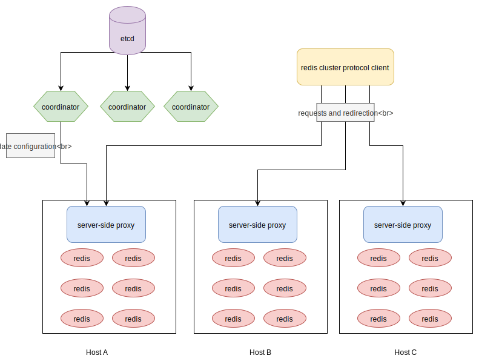

# Undermoon
Aims to provide a server-side Redis proxy implementing Redis Cluster Protocol.

# Architecture


# Initialize Server-side Proxy
```
> ./undermoon  # runs on port 5299 and forward commands to 127.0.0.1:6379
> redis-cli -p 5299
127.0.0.1:5299> umctl setdb 1 noflags mydb 127.0.0.1:6379 0-8000
127.0.0.1:5299> umctl setpeer 1 noflags mydb 127.0.0.1:7000 8001-16383
127.0.0.1:5299> auth mydb
OK
127.0.0.1:5299> get a
(error) MOVED 15495 127.0.0.1:7000
127.0.0.1:5299> set b 1
OK
```

## TODO
- Basic proxy implementation (done)
- Backend connection pool
- Slot map and cluster map (done)
- Implement AUTH command to select database (done)
- Implement meta data manipulation api (done)
- Implement coordinator
