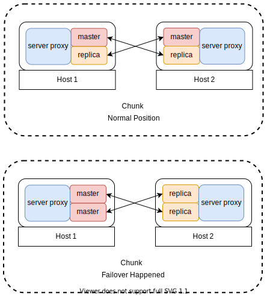

# Chunk

Chunk is the basic building block of a cluster to provide the created cluster
with a good topology for workload balancing.
It consists of 2 proxies and 4 Redis nodes evenly distributed in two machines.

Normally, the first half has 1 master and 1 replica and their peers locate in the second half.

After the second half failed, all the Redis nodes in the first half will become masters.

## Chunk Allocation
Instead of complex scheduling strategies and techniques,
`undermoon` employs a simple Redis node allocation algorithm
to achieve **workload balancing**:
- The masters should be evenly distributed in all machines.
- After failover happens, in each cluster,
  the flood of failed masters should be evenly distributed in all machines.

The algorithm detail and the proof of algorithm terminal is documented in
[chunk allocation](./chunk_allocation.txt).
