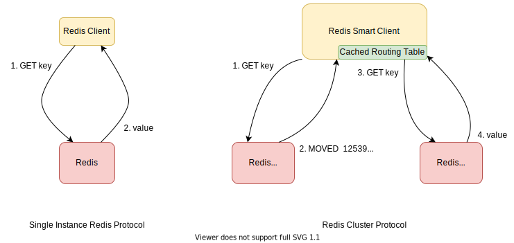
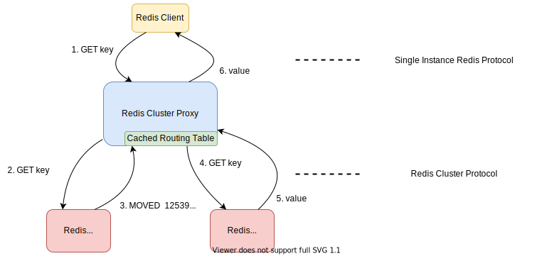

# Redis Cluster Protocol and Server Proxy
[Redis Cluster](https://redis.io/topics/cluster-tutorial) is the official Redis distributed solution supporting sharding and failover.
Compared to using a single instance redis, clients connecting to `Redis Cluster` need to implement the `Redis Cluster Client Protocol`.
What it basically does is:
- Redirecting the requests if we are not sending commands to the right node.
- Caching the cluster routing table from one of the two commands, `CLUSTER NODES` and `CLUSTER SLOTS`.

This kind of client is called the **Smart Client**.



To be compatible with the existing Redis client,
there're also some `Redis Cluster Proxies`
like [redis-cluster-proxy(official)](https://github.com/RedisLabs/redis-cluster-proxy),
[aster](https://github.com/wayslog/aster),
[corvus](https://github.com/eleme/corvus),
and [samaritan](https://github.com/samaritan-proxy/samaritan),
to adapt the cluster protocol to the widely supported single instance protocol.



#### How does Undermoon Implement the "Redis Cluster Protocol"?
Undermoon implements Redis Cluster Protocol based on a server-side proxy or Server Proxy.
The Server Proxy will act just like the official Redis Cluster Redis and return redirection response if needed.


#### Why another "Redis Cluster Protocol" implementation?
This implementation not only support horizontal scalability and high availability,
but also enable you to build a self-managed distributed Redis supporting:
- Redis resource pool management
- Serving multiple clusters for different users
- Spreading the flood evenly to all the physical machines
- Scaling fast
- Much easier operation and kubernetes integration.

#### Why server-side proxy?
Redis and most redis proxies such as redis-cluster-proxy, corvus, aster, codis are deployed in separated machines
as the proxies normally need to spread the requests to different Redis instances.

Instead of routing requests, server-side proxy serves as a different role from these proxies
and is analogous to the cluster module of Redis, which make it able to migrate the data and **scale fast**
by using some customized migration protocols.

#### Server-side Proxy
##### A small bite of server-side proxy and Redis Cluster Protocol

```bash
# Run a redis-server first
$ redis-server
```

```bash
# Build and run the server_proxy
> cargo build
> make server  # runs on port 5299 and will forward commands to 127.0.0.1:6379
```

```bash
> redis-cli -p 5299
# Initialize the proxy by `UMCTL` commands.
127.0.0.1:5299> UMCTL SETCLUSTER 1 NOFLAGS mydb 127.0.0.1:6379 1 0-8000 PEER mydb 127.0.0.1:7000 1 8001-16383

# Done! We can use it like a Redis Cluster!
# Unlike the official Redis Cluster, it only displays master nodes here
# instead of showing both masters and replicas.
127.0.0.1:5299> CLUSTER NODES
mydb________________9f8fca2805923328____ 127.0.0.1:5299 myself,master - 0 0 1 connected 0-8000
mydb________________d458dd9b55cc9ad9____ 127.0.0.1:7000 master - 0 0 1 connected 8001-16383

# As we initialize it using UMCTL SETCLUSTER,
# slots 8001-16383 belongs to another server proxy 127.0.0.1:7000
# so we get a redirection response.
#
# This is the key difference between normal Redis client and Redis Cluster client
# as we need to deal with the redirection.
127.0.0.1:5299> get a
(error) MOVED 15495 127.0.0.1:7000

# Key 'b' is what this proxy is responsible for so we process the request.
127.0.0.1:5299> set b 1
OK
```